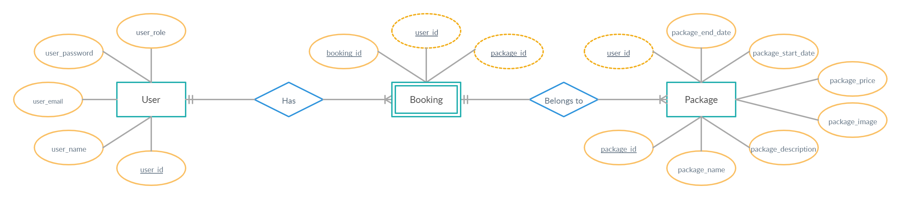
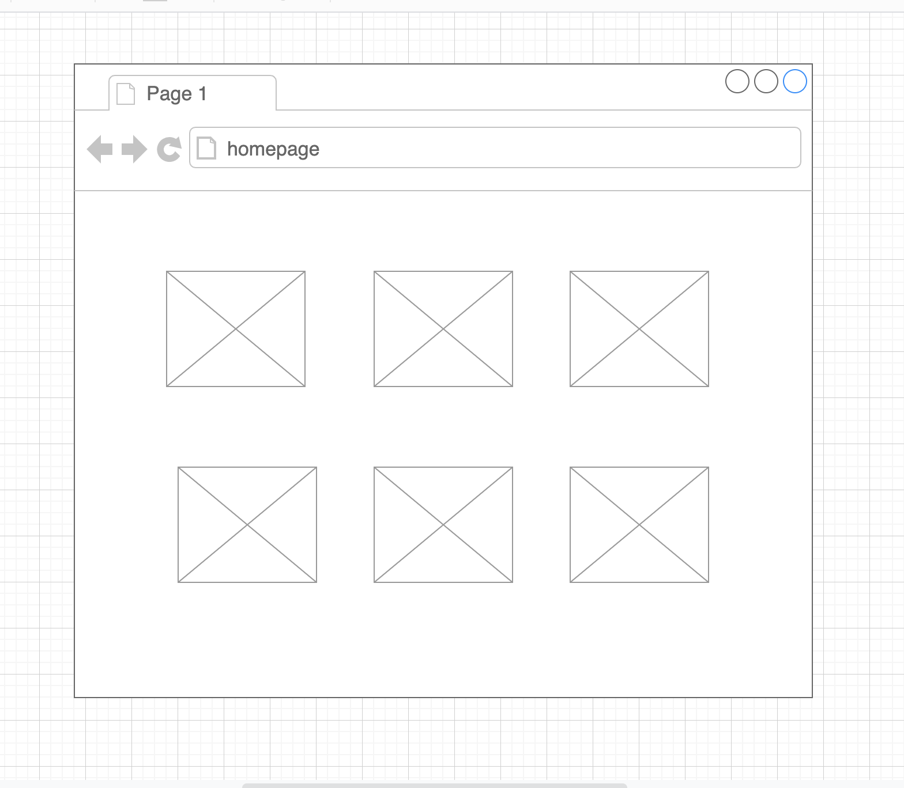
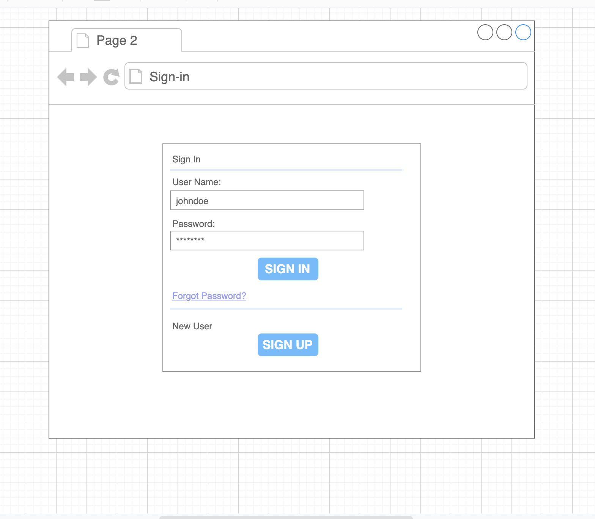
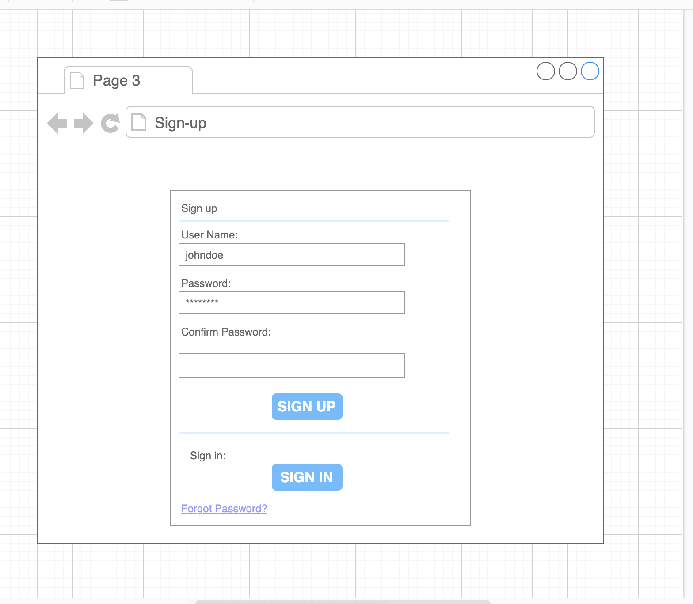
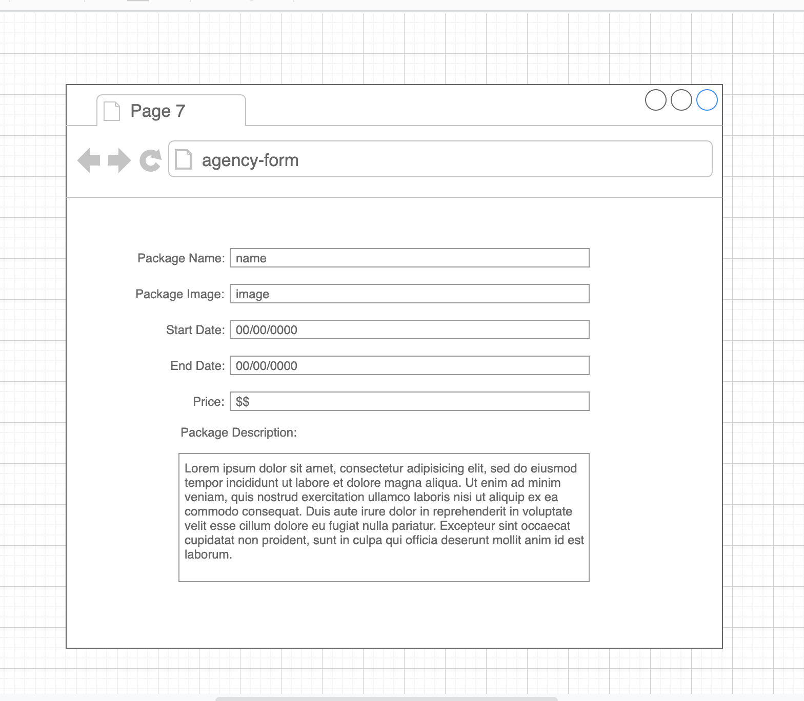

Agency App
======

# Table of Contents
* [ْUser Stories](#user-stories)
* [Entity Relationship Diagram](#Entity-Relationship-Diagram)
* [WireFrame](#WireFrame)
* [Development](#Development)
* [Bug / Feature Request](#Bug/Feature-Request)
* [Built with](#Built-with)
* [Authors](#Authors)

# Demo
Working live demo: [Amigoes App](https://amigos-agency-app.herokuapp.com/)

# User Story
* The user have the ability to discover any packages we offer without signing in and signing up.
* The customer have the ability to sign up and sign in.
* The customer have the ability to book any trip once he signs in.
* The customer have the ability to see the history of the previous booked trips.
* The agency have the ability to sign in and sign up.
* The agency have the ability to add and delete packages once he signed in.
* The agency have the ability to see the customers who booked the trip.

# Entity Relationship Diagram

# WireFrame

# Development
To fix a bug or improve the game features, follow the next steps:
* Fork the repo
* Create a new branch `git checkout -b fix-bugs` or `git checkout -b improve-features`
* Do the needed changes to the files
* Add your changes `git add .` to add all the files or `git add <your file name>` to add single file
* Commit your changes `git commit -m "Fix bugs"` or `git commit -m "Improve features"`
* Push to the branch `git push origin fix-bugs` or `git push origin improve-features`
* Create a New Pull Request
------

## Bug / Feature Request
If there is a bug, open an issue <a href="https://github.com/Moayad93/agency_app/issues">here</a> by including your issue with explanation.

## Built with
* Bootstrap (BootSwatch)
* Ruby on Rails

# Authors
* [Nouf Almatroudi](https://github.com/Nouf1/)
* [Abdulrahamn Aljammaz](https://github.com/Abdulrhman-J/)
* [Muneera Bin Hotan](https://github.com/Muneerabinhotan/)
* [Abdulrahman Alshabibi](https://github.com/shabams)
* [Moayad Alnuwaysir](https://github.com/Moayad93/) <em>(leader)</em>
